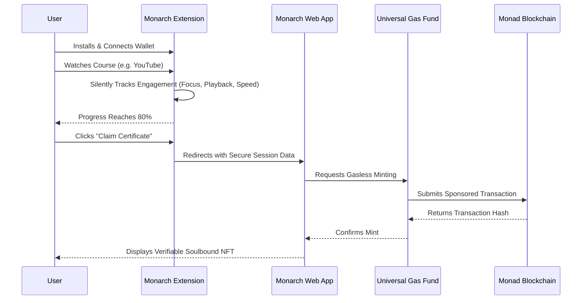
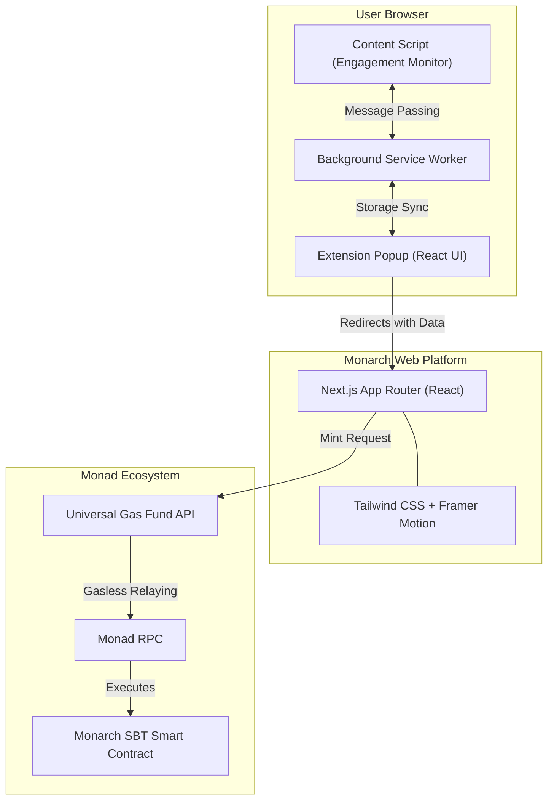

# Monarch 🛡️

**Skills Genuinely Verified. Not Just Completed.**

Monarch builds a credibility verification layer for online learning platforms. We verify whether you actually understood the content — not just clicked through it. Blockchain-backed, gasless, and genuinely trustworthy.


---

## 📖 The Problem We Solve
Developers and students are tired of meaningless completion badges. Traditional certificates prove you bought a course or clicked "Next," but they fail to prove actual understanding or engagement.

## ✨ Key Features & Capabilities

### 1. Verify Real Learning
We track active watch patterns, quiz consistency, engagement depth, and solving behavior to determine if you genuinely learned — no more meaningless completion badges.


### 2. Deep Analytics & Trust Score
See detailed breakdowns of watch presence, tab focus rates, playback patterns, code originality scores, and solving consistency metrics. Your **Monarch Score** reflects genuine understanding across platforms.


### 3. Blockchain-Backed Certificates (Gasless)
Mint tamper-proof Soulbound Tokens (SBTs) as proof of verified learning. Powered by the **Universal Gas Fund (UGF)**, meaning all blockchain transactions are sponsored in the background. **No ETH or crypto wallet required.**


### 4. Recruiter Verification Portal
Generate verification links that let employers audit your learning credentials — watch depth, solve patterns, and trust metrics — all on-chain and verifiable.


### 5. Seamless Platform Integration
Connect your Udemy, Coursera, LeetCode, HackerRank, or YouTube learning accounts. The Monarch extension silently monitors your real engagement.


---

## 🔄 The Monarch Workflow



1. **Install & Connect**: The user installs the Monarch Chrome Extension and connects their wallet.
2. **Learn Naturally**: The user navigates to a supported platform (e.g., YouTube). The extension silently tracks active watch segments, playback speeds, scrubbing behavior, and tab focus.
3. **Reach the Threshold**: Once the user genuinely watches (or reaches) 80% of the video, their session becomes eligible.
4. **Claim & Redirect**: The user clicks "Claim Certificate" in the extension, which redirects them to the Monarch web app with their verified session data.
5. **Gasless Minting on Monad**: The web app utilizes the **Universal Gas Fund (UGF)** to mint a Soulbound Token (SBT) directly to the user's wallet on the blazing-fast **Monad** ecosystem—completely gasless, with zero crypto needed from the user.

---

## 🛠️ Architecture & Tech Stack

Monarch is a full-stack monorepo designed to leverage the high-throughput, low-latency capabilities of the **Monad Blockchain** while providing a buttery-smooth Web2-like user experience.



### 🟣 Why Monad?
Monarch issues highly dynamic, verifiable Soulbound Tokens (SBTs) that contain granular engagement data. We chose **Monad** because its parallel execution environment and massive throughput (10,000 TPS) allow us to mint thousands of certificates instantly without network congestion or ridiculous gas spikes. Monad gives Monarch the scalability required to disrupt the global EdTech certification market on-chain.

### 🌐 Web Application (Frontend & API)
- **Framework**: Next.js 16 (App Router)
- **Styling**: Tailwind CSS v4, Framer Motion (for fluid micro-animations)
- **Icons & UI**: Lucide React, Radix UI primitives
- **Blockchain Interaction**: Ethers.js v6
- **Gasless Transactions**: `@tychilabs/ugf-testnet-js` (Universal Gas Fund) for abstracting Monad gas fees.
- **Deployment**: Vercel

### 🧩 Browser Extension
- **Framework**: [Plasmo](https://docs.plasmo.com/) (React-based Extension Framework)
- **Language**: TypeScript
- **Tracking Core**: Custom `EngagementMonitor` and `SessionManager` running in Content Scripts to securely evaluate video DOM elements, `timeupdate` events, and document visibility.
- **State Management**: `@plasmohq/storage` for syncing session state between content scripts, background service workers, and the popup UI.

---

## 🚀 Getting Started

### 1. Web Platform (Next.js)

First, install dependencies and run the development server:
```bash
npm install
npm run dev
```

Open [http://localhost:3000](http://localhost:3000) with your browser to see the platform.

### 2. Browser Extension

Navigate to the extension directory:
```bash
cd monarch-extension/extension
npm install
npm run dev
```
Then load the unpacked extension into Chrome from the `monarch-extension/extension/build/chrome-mv3-dev` directory.

---

## 🎨 Design System

Monarch utilizes a distinct **premium visual identity**:
- **Backgrounds:** Mesh gradient dark modes (`#000000`) and translucent glass card panels (`.premium-glass`).
- **Typography:** Heavy tracking uppercase (`tracking-tighter`, `tracking-[0.3em]`) for primary headings and system labels.
- **Micro-Animations:** Fluid scaling transitions on hover, dynamic ambient background glows, and pulse indicators for live sessions.

*(Refer to `gemini.md` for specific design tokens and CSS clones).*


